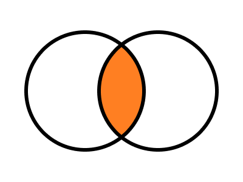
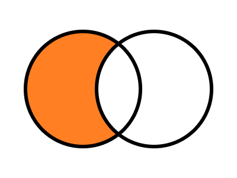

<div align="center">
  <h1>
    
  </h1>
  <p>A utility library for working with sets.</p>
  <p>
    
    
  </p>
</div>

## Features

- Flow and TypeScript declarations included.
- CommonJS, UMD and ESM modules provided.
- Zero dependencies.

## Installation

Yarn:

```shell
yarn add set-fns
```

NPM:

```shell
npm install set-fns
```

## Usage

```js
import { set, union, intersection, difference, subset } from "set-fns";

const alphabet = set("abcdefghijklmnopqrstuvwxyz".split(""));

const sentence = set("the quick brown fox jumped over the lazy dog!".split(""));

console.log("All characters", union(alphabet, sentence));

console.log(
  "Characters from the alphabet used in the sentence",
  intersection(alphabet, sentence)
);

if (!subset(sentence, alphabet)) {
  console.log(
    "Extra character(s) found in sentence!",
    difference(sentence, alphabet)
  );
}
```

## API

### set

```ts
declare const set: <T>(x?: Iterable<T>) => Set<T>;
```

Takes an iterable and returns a set of all items in that iterable. If the iterable is already a set it is returned unchanged.

```js
const a = set([1, 2, 3]); // Set { 1, 2, 3 }
const b = set(a); // Set { 1, 2, 3 }
const c = set([1, 2, 3]); // Set { 1, 2, 3 }
a === b; // true
a === c; // false
```

### and / intersection



```ts
declare const and: <T>(a: Iterable<T>, b: Iterable<T>) => Set<T>;
```

Takes two iterables and returns a set of all items that appear in both.

```js
const a = [1, 2, 3, 4];
const b = [6, 5, 4, 3];
and(a, b); // Set { 3, 4 }
intersection(a, b); // Set { 3, 4 }
```

### or / union


```ts
declare const or: <T>(a: Iterable<T>, b: Iterable<T>) => Set<T>;
```

Takes two iterables and returns a set of all items that appear in either.

```js
const a = [1, 2, 3, 4];
const b = [6, 5, 4, 3];
or(a, b); // Set { 1, 2, 3, 4, 5, 6 }
union(a, b); // Set { 1, 2, 3, 4, 5, 6 }
```

### not / subtract / difference



```ts
declare const not: <T>(a: Iterable<T>, b: Iterable<T>) => Set<T>;
```

Takes two iterables and returns a set of all items that appear the first, but not the second.

```js
const a = [1, 2, 3, 4];
const b = [6, 5, 4, 3];
not(a, b); // Set { 1, 2 }
subtract(a, b); // Set { 1, 2 }
difference(a, b); // Set { 1, 2 }
```

### xor


```ts
declare const xor: <T>(a: Iterable<T>, b: Iterable<T>) => Set<T>;
```

Takes two iterables and returns a set of all items that appear exclusively in the first or the second (do not appear in both iterables).

```js
const a = [1, 2, 3, 4];
const b = [6, 5, 4, 3];
xor(a, b); // Set { 1, 2, 5, 6 }
```

### equal

```ts
declare const equal: (a: Iterable<any>, b: Iterable<any>) => boolean;
```

Takes two iterables and returns true if both contain the exactly the same items.

```js
const a = [1, 2, 3];
const b = [3, 2, 1];
const c = [3, 3, 2, 2, 1, 1];
equal(a, b); // true
equal(a, c); // true
```

### subset

```ts
declare const subset: (a: Iterable<any>, b: Iterable<any>) => boolean;
```

Takes two iterables and returns true if the first is a subset of the second.

```js
const a = [1, 2];
const b = [1, 2, 3];
const c = [1, 2];
subset(a, b); // true
subset(a, c); // true
```

### strictSubset

```ts
declare const strictSubset: (a: Iterable<any>, b: Iterable<any>) => boolean;
```

Takes two iterables and returns true if the first is a strict subset of the second.

```js
const a = [1, 2];
const b = [1, 2, 3];
const c = [1, 2];
strictSubset(a, b); // true
strictSubset(a, c); // false
```

### superset

```ts
declare const superset: (a: Iterable<any>, b: Iterable<any>) => boolean;
```

Takes two iterables and returns true if the first is a superset of the second.

```js
const a = [1, 2, 3];
const b = [1, 2];
const c = [1, 2, 3];
superset(a, b); // true
superset(a, c); // true
```

### strictSuperset

```ts
declare const strictSuperset: (a: Iterable<any>, b: Iterable<any>) => boolean;
```

Takes two iterables and returns true if the first is a strict superset of the second.

```js
const a = [1, 2, 3];
const b = [1, 2];
const c = [1, 2, 3];
strictSuperset(a, b); // true
strictSuperset(a, c); // false
```
